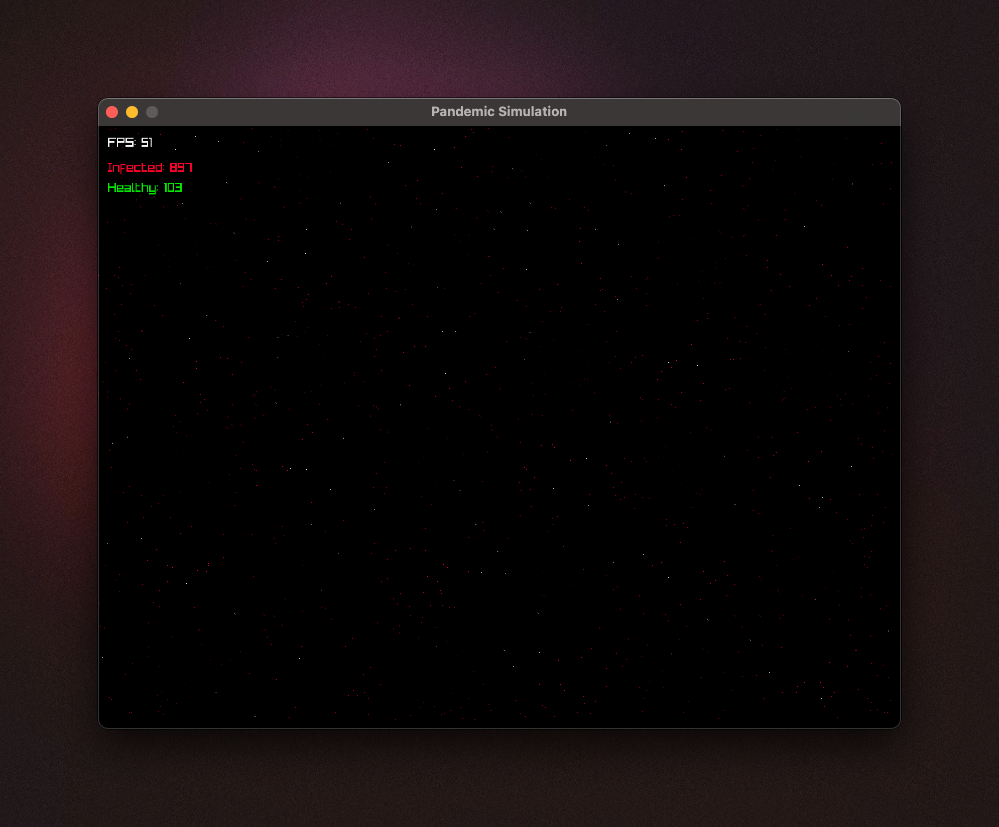

# 🌐 Pandemicrs

Welcome to the **Pandemicrs** project! This interactive simulation visualizes the spread of an infectious disease among a simulated population within a graphical environment, crafted using Rust and Raylib.

<!-- add image from ./resources/pandemicrs.png -->



## 📋 Features

-  **Real-time Simulation**: Watch as a virtual population interacts and experiences the spread of an infection in real-time.
-  **Infection Dynamics**: Visualize how proximity and time influence the spread of the disease among individuals.
-  **Customizable Settings**: Adjust parameters such as population size and infection radius to see how they impact the dynamics of the infection.
-  **Graphical Representation**: Each individual is represented as a pixel on the screen that changes color based on their infection status.
-  **Performance Metrics**: Real-time display of frames per second (FPS) and a count of healthy vs. infected individuals.

## 🚀 Setup and Run

### Prerequisites

-  Ensure you have [Rust installed](https://www.rust-lang.org/tools/install) on your system.
-  Run `cargo add raylib`

### Running the Simulation

1. Clone the repository:
   ```bash
   git clone https://github.com/yourgithub/pandemic-simulation.git
   cd pandemic-simulation
   ```

2. Compile and run the program:
   ```bash
   cargo run
   ```

## ⚙️ Configuration

You can modify the following constants in the code to tweak the simulation settings:

-  `WINDOW_DIMENSIONS`: Set the dimensions of the window where the simulation runs.
-  `POPULATION_SIZE`: Define the number of individuals in the simulation.
-  `INFECTION_RADIUS`: Adjust the radius within which the infection can spread.
-  `INFECTION_DURATION`: Set the duration an individual remains infectious.

## 📊 Understanding the Output

-  **White Pixel**: Represents a healthy individual.
-  **Red Pixel**: Represents an infected individual.
-  **FPS Display**: Shows how many frames per second the simulation is running.
-  **Infection Counters**: Displays the current number of infected and healthy individuals.

Feel free to explore and modify the behavior of the simulation to understand more about the spread of infectious diseases!

## 🤝 Contributions

Contributions are welcome! Please feel free to fork the project, make changes, and submit a pull request.